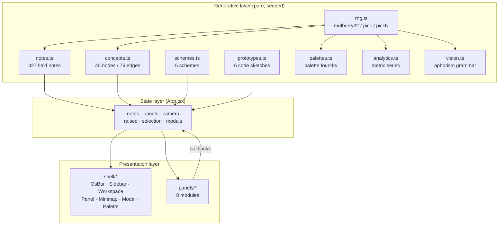
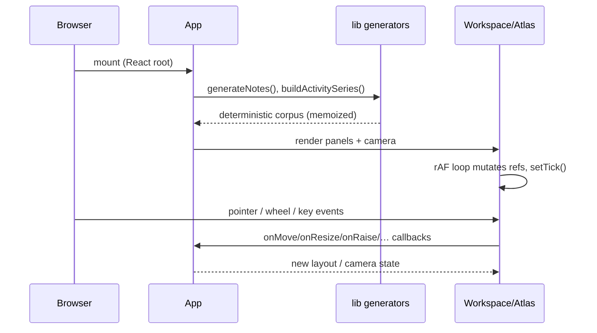

# Architecture

NEXUS // Creative Cortex v4.1 is a single-page, client-only React application. There is no backend, no database, no network state (fonts aside). Everything the user sees is derived at boot from a handful of deterministic seeds and held in React state or refs.

This document is the system-level explanation. Subsystem detail lives under [`docs/technical/`](docs/technical/); design rationale under [`docs/design/`](docs/design/); the artistic reading under [`docs/creative/concept.md`](docs/creative/concept.md).

## Overall system design

The system decomposes into three layers with strictly one-directional data flow:

1. **Generative layer (`src/lib`)** — pure, seeded, testable functions and data. Produces the corpus (notes, concepts, edges, schemes, prototypes, palettes, analytics series) once per boot.
2. **State layer (`App`)** — owns all *interactive* state: panel layout, camera, raised panel, selection, modals, palette visibility, and the committed-notes list (base corpus + user-synthesized notes).
3. **Presentation layer (`components/shell`, `components/panels`)** — renders state; the shell provides workspace chrome and primitives; the panels are the eight modules.

## Application lifecycle

1. **Boot.** `main.tsx` mounts `App`. `App` lazily initialises `notes` (327) and the activity series via `useMemo`/initializers — stable across re-renders.
2. **Render.** `Workspace` computes the camera transform and mounts each visible `Panel` with its module content.
3. **Animate.** `NeuralGraph` and `VisionStream` run their own rAF/interval loops; they keep mutable state in refs and trigger re-render via a tick counter or typed-text state.
4. **Interact.** Pointer/wheel/keyboard events flow to handlers that call `App` callbacks; `App` updates state; React re-renders.

## Modules

- `src/lib/rng.ts` — the only source of randomness; mulberry32 plus `pick`, `pickN`, `between`.
- `src/lib/config.ts` — corpus sizes, seeds, force constants, stage extents, camera clamps. The single place to tune physics/content.
- `src/lib/banks.ts` — the vocabulary: domains, adjectives, nouns, phenomena, tags, verbs, and the domain→colour map.
- `src/lib/concepts.ts` — builds the 45 concept nodes (3 per domain, placed on a ring) and 76 edges (intra-domain clusters + cross-domain bridges + hub ring).
- `src/lib/notes.ts` — composes titles + bodies from template banks and wires inter-note links.
- `src/lib/vision.ts` — the aphorism fragment grammar and the `synthesize()` combinator for the forge.
- `src/lib/analytics.ts`, `palettes.ts`, `schemes.ts`, `prototypes.ts` — metric series, palette foundry, and curated data.
- `src/lib/highlight.ts` — pure regex tokenizer (no JSX) for the code viewer.
- `src/lib/layout.ts` — panel metadata and default layout; re-exports stage extents.
- `src/lib/icons.tsx` — lucide icon registry keyed by name.

## State architecture

| State | Owner | Kind |
| --- | --- | --- |
| `notes` (base + committed) | `App` | source of truth |
| `panels` (x/y/w/h/visible) | `App` | source of truth |
| `raisedId`, `focusTarget`, `expanded`, modals | `App` | ephemeral UI |
| camera (pan/scale), `panning` | `Workspace` | local |
| node positions/velocities, pulses | `NeuralGraph` | refs (mutable) |
| typed aphorism + feed | `VisionStream` | local |
| palette locks / current palette | `HexLab` | local |

The split is deliberate: **shared, cross-module state** (notes, layout) lives in `App`; **self-contained widget state** stays local; **high-frequency simulation state** lives in refs to avoid re-render storms.

## Rendering architecture

- **Workspace camera.** A single `transform: translate(...) scale(...)` on the stage; pan via pointer capture, zoom clamped to `CAMERA.minZoom..maxZoom`, `fit()` derives scale from viewport/stage ratio.
- **Panels.** Absolutely positioned; drag via header pointer capture with 8px snapping; resize via a grip; `framer-motion` only for mount/exit transitions.
- **Atlas.** One SVG; edges (lines), pulses (animated circles), nodes (gradient circles + labels). Refs mutated in a rAF loop; `setTick` forces a render per frame. Node lookup via a Map.
- **Modals.** `framer-motion` `AnimatePresence`; three instances (expand, note, code) driven by `App`.

## Data architecture

All data is in-memory and immutable-after-boot except: (a) `notes` grows when the forge commits; (b) atlas node positions mutate. Nothing persists. This is a deliberate constraint: the artefact is reproducible and stateless.

## Event flow

Pointer and keyboard events are handled at the lowest component that owns the relevant state and surfaced to `App` only as semantic callbacks (`onMove`, `onResize`, `onRaise`, `onHide`, `onExpand`, `onOpenNote`, …). `App` never sees raw pointer coordinates.

## External dependencies

| Dep | Role |
| --- | --- |
| react / react-dom | UI + state |
| framer-motion | mount/exit transitions for panels and modals |
| lucide-react | icon set |
| tailwindcss (+@tailwindcss/vite) | utility CSS driven by `@theme` tokens |
| dev: vite, typescript, eslint, vitest, playwright/puppeteer-core | build, check, test, capture |

`react-router-dom` was removed (unused; it carried high-severity advisories).

## Browser APIs used

`requestAnimationFrame`, Pointer Events + `setPointerCapture`, `ResizeObserver`, `getScreenCTM`/`createSVGPoint` (SVG coordinate mapping), `matchMedia`-free (no media queries in JS), `navigator.clipboard` (Hex Lab copy), `sessionStorage`-free. No WebGL; rendering is SVG + CSS.

## Build pipeline

`vite.config.ts` sets `base` (Pages sub-path in production, `/` in dev, overridable via `VITE_BASE`), registers the React + Tailwind plugins, binds servers to all interfaces, and emits source maps. `tsc -b` typechecks before bundling.

## Performance model

- **CPU:** atlas O(n²) repulsion, n=45 → ~1k pair ops/frame; negligible. The dominant cost is React re-rendering the atlas SVG each frame.
- **GPU:** `backdrop-filter` on glass surfaces.
- **Memory:** ~327 notes + 45 nodes + small arrays; trivial.
- **Bundle:** ~415 kB JS (136 kB gzip), dominated by React + framer-motion.

## Major design decisions & compromises

1. **Determinism over dynamism.** Seeded generators make the artefact reproducible (CI, screenshots, deployment) at the cost of "live" novelty. Chosen deliberately.
2. **Refs for the simulation.** Reading refs during render violates the newest react-hooks lint orthodoxy; we keep it (documented relaxations in `eslint.config.js`) because it is the cleanest way to run a 60fps simulation without thrashing React state.
3. **A regex tokenizer, not a real highlighter.** Proportionate to a decorative viewer; documented in `src/lib/highlight.ts`.
4. **One generated bitmap.** `atlas-bg.png` is produced by a Node script so the only raster in the project is itself procedural and matches the CSS field.
5. **No persistence.** The OS forgets on reload; this is part of the fiction and keeps the system stateless.

## Limitations

- Not screen-reader friendly (pointer-driven stage).
- `backdrop-filter` degrades on low-end GPUs.
- The tokenizer is not a general highlighter.
- No reduced-motion handling yet.
