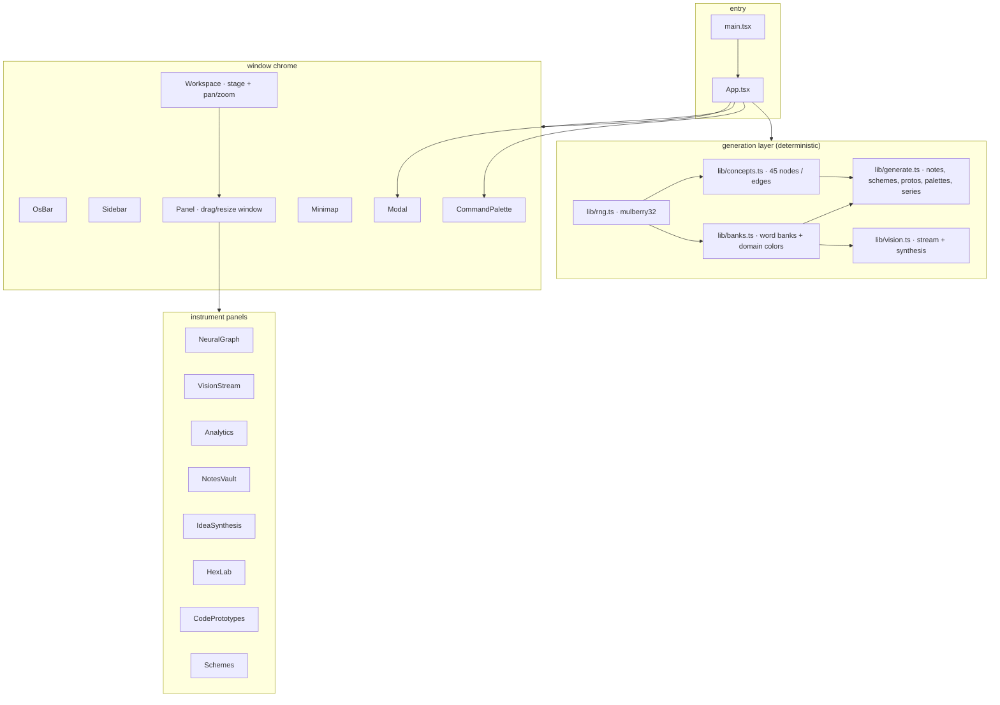
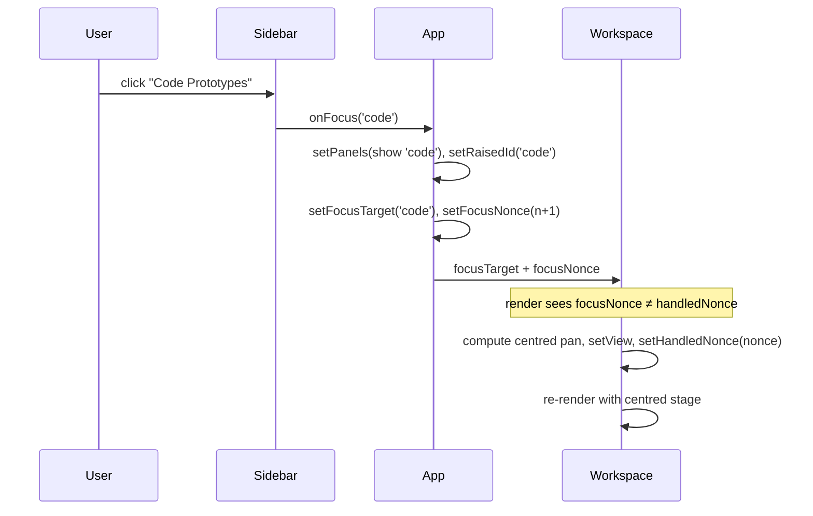
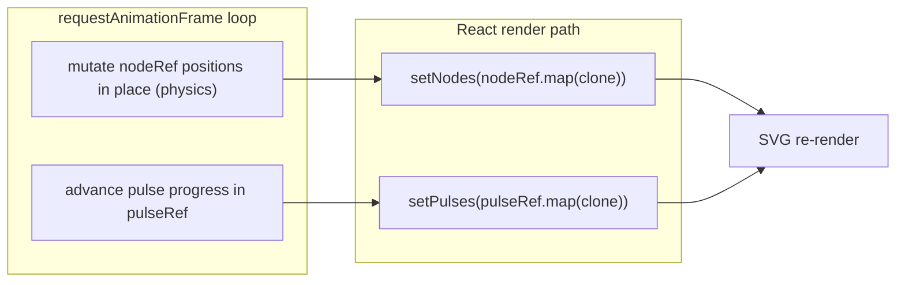
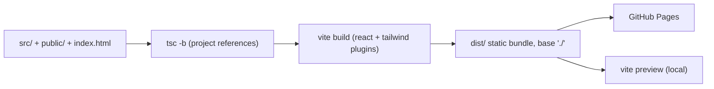

# Architecture — NEXUS // OS (Creative Cortex v4.1)

This document explains the system end to end: what the pieces are, how they are
wired together, how state and rendering flow, and which trade-offs were made.
It is the bridge between the README's orientation and the subsystem detail in
[`docs/technical/`](docs/technical/).

---

## 1. System overview

NEXUS//OS is a **single-view React 19 SPA** with no router, no backend, and no
runtime data dependency. Every byte of content the interface shows is generated
in the browser from a handful of curated word banks and one seeded PRNG
(`mulberry32`). The application layer on top of that generated content is a
hand-rolled spatial window manager: a large "stage" that the user pans, zooms,
and populates with draggable, resizable, stackable panels.



---

## 2. Application lifecycle

1. **Mount.** `main.tsx` renders `<App/>` in `StrictMode`. StrictMode's
   double-invocation is observable only in dev and is why the deterministic
   generators (pure functions of a seed) are important — they produce identical
   output on the second mount.
2. **Content generation.** `App` initialises state lazily: `generateNotes()`
   builds the 327-note vault once; `DEFAULT_PANELS` seeds the window layout;
   `buildActivitySeries()` is memoised for the OS-bar sparkline.
3. **Viewport.** `Workspace` attaches a `ResizeObserver` and records the
   stage's on-screen size, re-clamping the pan so the view cannot be lost off
   the stage.
4. **Run loop.** `NeuralGraph` starts a `requestAnimationFrame` physics loop;
   `VisionStream` starts a 30 ms typing ticker; `OsBar` starts a 1 s clock.
5. **Interaction.** Pointer events drive panel drag/resize and stage pan/zoom;
   keyboard drives the command palette (`Ctrl/⌘+K`) and Escape-based dismissal.
6. **Teardown.** Every `setInterval`, `requestAnimationFrame`, `ResizeObserver`,
   and window listener is cleaned up in its owning effect's return value.

---

## 3. State architecture

State is **lifted to `App`** and passed down through props. There is no context,
no external store, and no reducer. This is deliberate: the state surface is
small, and most "state" in the app is derived data that never changes after the
first render.

| State (owner) | Type | Mutated by |
| --- | --- | --- |
| `notes` (App) | `Note[]` | initial generation; `IdeaSynthesis` commits |
| `panels` (App) | `PanelState[]` | move/resize/hide/toggle/reset/focus |
| `raisedId` (App) | `string \| null` | panel raise on pointer-down |
| `focusTarget` + `focusNonce` (App) | `string \| null`, `number` | sidebar focus |
| `expanded` / `selectedNote` / `selectedProto` (App) | id or object | modal open/close |
| `paletteOpen` (App) | `boolean` | `Ctrl/⌘+K`, button, Escape |
| `visionIndex` (App) | `number` | VisionStream "new entry" callback |
| `view` — pan/scale (Workspace) | `{pan, scale}` | drag, wheel, zoom buttons, minimap, fit |
| `vp` (Workspace) | `{w, h}` | ResizeObserver |
| node positions (NeuralGraph) | refs + per-frame snapshot | RAF physics loop, pointer drag |
| generator + feed (VisionStream) | state | 30 ms typing ticker |

### The focus/zoom model

Focusing a module (sidebar click) must both **show** the panel and **centre** the
view on it. This is implemented with a monotonically increasing `focusNonce`:



Centring runs **during render** (the React "adjust state on prop change"
pattern) rather than in an effect, which keeps it synchronous, idempotent, and
free of the cascading-render effect of `setState`-in-`useEffect`.

---

## 4. Rendering architecture

Rendering is split along two paths:

- **SVG** — the knowledge graph (edges, travelling pulses, nodes, labels), the
  analytics area chart, radar, sparkline, and gauges. These are genuinely
  resolution-independent and cheap to re-draw each frame.
- **DOM / Tailwind** — all window chrome: headers, borders, glass surfaces,
  buttons, lists, the palette and modals. Styled with Tailwind utilities plus a
  small set of design tokens defined in `src/index.css` (`@theme`).

The Neural Atlas is the only component that re-renders continuously. Its pattern
is worth noting because it satisfies React's render rules while mutating state
every frame:



The refs are the **physics working set** (never read during render); a shallow
clone is copied into state once per frame so the SVG renders from plain state.
Dragging a node writes to the ref directly, and the next frame's snapshot
propagates the new position into the render.

---

## 5. Data architecture

```mermaid
flowchart LR
    seed["seeds: 1337, 20240517, 7, 99, 42…"] --> mul["mulberry32"]
    mul --> pick["pick / pickN / between"]
    banks["banks.ts: 15 domains, 40 adjectives, 34 nouns, 28 phenomena, 29 tags"]
    pick --> notes["generateNotes → 327 Note objects"]
    pick --> series["activity / radar / velocity series"]
    pick --> palettes["generatePalette → 6-hex palettes"]
    concepts["concepts.ts: 45 curated node labels (3/domain)"] --> edges["92 weighted edges"]
    vision["vision.ts: fragment templates A/B/C + synthesis templates"] --> stream["VisionGenerator"]
    notes --> vault["NotesVault / NoteDetail / CommandPalette"]
    edges --> graph["NeuralGraph"]
    series --> analytics["Analytics / OsBar"]
```

Design properties of the data layer:

1. **Determinism.** Same seed ⇒ identical vault, graph, and series. This is what
   makes the unit tests exhaustive and the interface stable across reloads.
2. **No persistence.** All generated state lives in memory and is rebuilt on
   reload. Persistence (layout, committed notes, palettes) is a documented
   roadmap item, not an oversight.
3. **Curated vocabulary, procedural structure.** The *words* are hand-written
   (and are the artistic content); the *composition* is procedural. `banks.ts`
   is the corpus; `generate.ts` and `vision.ts` are the grammar.
4. **Stateless at runtime.** `lib/generate.ts` and `lib/vision.ts` expose pure
   functions and one tiny class (`VisionGenerator`, which only wraps a counter +
   RNG). Everything is testable without a DOM.

---

## 6. Audio architecture

**There is no audio subsystem in v4.1.** The project is currently a visual and
textual instrument; none of the "signal" language in the UI (vision stream,
resonance, activity) is audible. WebAudio/AudioWorklets, generative sequencing,
and spatial audio are concrete roadmap directions (see
[`ROADMAP.md`](ROADMAP.md)) but are **not** claimed as existing features.

---

## 7. Event flow

Pointer and keyboard events are the only input channels.

```mermaid
flowchart TB
    subgraph pointer["pointer events"]
        drag["panel header drag"] --> move["move panel (8px grid)"]
        resize["corner drag"] --> rsize["resize panel"]
        stage["empty stage drag"] --> pan["pan view"]
        wheel["Ctrl+wheel"] --> zoom["zoom at cursor"]
        node["node drag"] --> phys["physics ref mutation"]
    end
    subgraph keyboard["keyboard"]
        ck["Ctrl/⌘+K"] --> palette["toggle palette"]
        esc["Escape"] --> close["close palette / modal"]
        arrows["↑↓ / Enter"] --> exec["palette selection"]
    end
    pointer --> setstate["setState in App / Workspace / NeuralGraph"]
    keyboard --> setstate
```



Gestures are implemented with the Pointer Events API and `setPointerCapture`,
so a drag continues correctly even when the pointer leaves the element mid-gesture.

---

## 8. External dependencies

| Dependency | Purpose | Why |
| --- | --- | --- |
| `react` / `react-dom` 19 | component model | baseline |
| `typescript` 5.9 | types across the codebase | strict mode |
| `vite` 7 + `@vitejs/plugin-react` | dev server + build | HMR, fast build |
| `tailwindcss` 4 + `@tailwindcss/vite` | utility styling + design tokens | CSS-first theming via `@theme` |
| `framer-motion` 12 | modal/panel enter/exit animation | spring + exit (AnimatePresence) |
| `lucide-react` | icon set | consistent 1.5px-stroke instrument icons |
| `@fontsource/*` | self-hosted Space Grotesk + JetBrains Mono | no font CDN at runtime |
| `eslint` 9 + `typescript-eslint` + `eslint-plugin-react-hooks` | static analysis | React hooks/compiler rules |
| `vitest` | unit tests | fast, esbuild-based |
| `playwright` (+ optional `@sparticuz/chromium-min`) | screenshot capture | real browser captures |

### Browser APIs used

- `requestAnimationFrame` — graph physics + per-frame snapshot
- `ResizeObserver` — stage viewport tracking
- `PointerEvent` + `setPointerCapture` — drag/resize/pan
- `navigator.clipboard` — Hex Lab copy
- SVG `radialGradient`, `<animate>`, `getScreenCTM` — graph rendering and
  coordinate mapping between screen and SVG space
- `sessionStorage` — none (all state is in memory)

---

## 9. Build pipeline



- **Type checking** uses two TypeScript project references: `tsconfig.app.json`
  (app + tests) and `tsconfig.node.json` (Vite config). `tsc -b` builds both.
- **Linting** uses a flat ESLint config with the React hooks/compiler rules
  (`eslint-plugin-react-hooks` v7), which is why the codebase avoids reading
  refs during render and `setState`-in-effect patterns.
- **Testing** runs Vitest over `tests/unit/` in a Node environment (a separate
  `vitest.config.ts` so the React/Tailwind plugins are not loaded for pure-logic
  tests).
- **Screenshots** are produced by `scripts/capture-screenshots.mjs`, which
  builds, serves `dist/`, and drives a headless browser.

---

## 10. Performance model

- **The hot path** is the Neural Atlas: O(n²) repulsion over 45 nodes plus edge
  springs, one SVG re-render per frame at 60 fps. n² at 45 nodes is ~2,000
  distance computations per frame — deliberately fine. See
  [`docs/technical/performance.md`](docs/technical/performance.md) for the
  budget and the scaling plan.
- **Backdrop-filter surfaces** (glass panels, palette, modals) are the main GPU
  cost; under software rendering (headless capture) they dominate, which is why
  captures run at 1440×900 rather than 2×.
- **Everything else** renders once. Analytics, vault, schemes, and code panels
  are static after mount; the vision ticker updates only its own small subtree.

---

## 11. Major design decisions

1. **No backend, no runtime data.** The entire "mind" is generated client-side.
   This keeps the project deployable anywhere static, auditable in full, and
   honest about its own artifice.
2. **Deterministic RNG as the artistic spine.** `mulberry32` with fixed seeds
   makes the fiction reproducible — the same fake knowledge every visit — which
   is itself the joke about a "stable" intelligence.
3. **Custom physics, no physics library.** 45 nodes don't justify a library; the
   hand-rolled loop is ~80 lines and fully inspectable.
4. **A window manager inside the window.** Instead of a page, the app is a
   pannable 2360×1180 stage. This is what makes it feel like an *operating
   system* rather than a dashboard.
5. **Self-hosted fonts.** No Google Fonts request at runtime; the app renders
   identically offline and in restricted networks.
6. **React-hooks-clean animation.** The graph's per-frame work is kept in refs
   and mirrored to state, satisfying the compiler-oriented lint rules without
   abandoning the 60 fps loop.

---

## 12. Technical compromises & limitations

- **O(n²) physics** limits node count; a spatial-hash or WebGL port is the
  scaling path, not assumed here.
- **SVG** is the rendering medium for the graph; at node counts in the
  hundreds it would need canvas/WebGL.
- **No persistence** — by design in v4.1, but a real cost for any
  "instrument" use case; it is the top roadmap item.
- **Pointer-first interaction** — the graph has no keyboard node navigation.
- **Template-based generation** — "synthesis" and "vision" are composed from
  fixed grammars, not a model; the constraint is the concept.

---

## 13. Where to go next

- **Concept →** [`docs/concept.md`](docs/concept.md)
- **Subsystems →** [`docs/technical/`](docs/technical/)
- **Design →** [`docs/design/`](docs/design/)
- **Development →** [`docs/development/`](docs/development/)
- **Roadmap →** [`ROADMAP.md`](ROADMAP.md)
