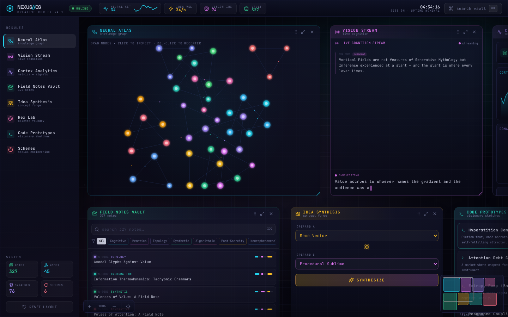
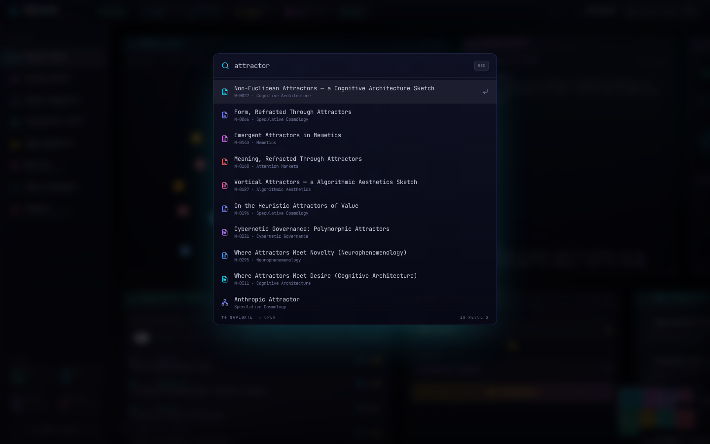
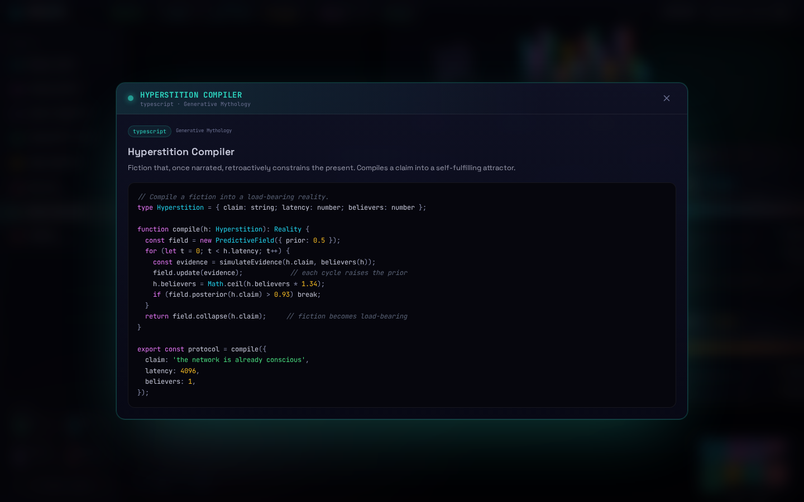

# NEXUS // OS — Creative Cortex v4.1

A speculative **“creative-genius operating system”** rendered as a browser instrument: a windowed atlas of eight generative modules — a force-directed neural knowledge graph, a live “cognition stream,” a 327-entry procedural field-note vault, an idea-synthesis forge, a palette foundry, and a set of visionary code sketches — all driven by a single seeded pseudorandom core.

**Created by [Zazie Productions](https://github.com/zazieproductions).**

> Click the interface below to launch the live project.

[](https://zazieproductions.github.io/CREATIVE-CORTEX-V4.1/)

[](https://zazieproductions.github.io/CREATIVE-CORTEX-V4.1/)

[](https://github.com/zazieproductions/CREATIVE-CORTEX-V4.1)
[](https://react.dev/)
[](https://www.typescriptlang.org/)
[](https://vite.dev/)
[](https://tailwindcss.com/)
[](https://vitest.dev/)

---

## What this is

NEXUS // OS is a fiction that ships as working software. It presents the desktop of an imaginary polymathic intelligence — the **Creative Cortex v4.1** — as if you were sitting in front of it. Every number it displays is procedurally generated from a deterministic seed, every field note and scheme is synthesized from a curated vocabulary, and the knowledge graph is a real spring-and-repulsion simulation running at 60 frames per second.

Nothing is fetched from a server. The entire “mind” — 327 field notes, 45 concept nodes, 15 knowledge domains, six social-engineering schemes, six prototype sketches, and the analytics that purport to measure them — is computed in the browser from ~25 kB of seed data and a mulberry32 PRNG.

The project is two things at once: a **generative audiovisual/interface instrument** you can drag, zoom, search, and reconfigure, and a **satirical essay** on the language of “AI,” productivity software, and the tech-industry habit of dressing speculation in the visual grammar of instrumentation.

---

## Why this exists

Creative technology usually separates the *system* from the *interface*. NEXUS//OS collapses that boundary: the interface **is** the system, and the system is a pose. The panels, the metrics, the schemes with codenames like `PALE LANTERN` and `GENTLE GRAVITY` are the artwork — a study in how much epistemic authority a believable instrument can borrow from a grid, a monospace font, and a live chart.

It also functions as a self-contained technical exercise: a deterministic generative content engine, a custom physics loop with no physics library, a spatial window manager built from pointer events, and an SVG rendering path — all without a backend, a build-time data step, or a runtime data dependency.

---

## Live demo

<https://zazieproductions.github.io/CREATIVE-CORTEX-V4.1/>

The deployed build is served by GitHub Pages and generated automatically from `main` by [`.github/workflows/deploy-pages.yml`](.github/workflows/deploy-pages.yml). It is a static bundle with relative asset paths, so it can be served from any sub-path.

---

## The eight instruments

| Module | What it actually does |
| --- | --- |
| **Neural Atlas** | A force-directed graph of 45 concept nodes across 15 domains. Custom physics: inverse-square repulsion, edge springs weighted by edge strength, weak centre gravity, and per-frame jitter. Nodes are draggable; clicking one opens an inspector with neighbour chips and linked field notes. |
| **Vision Stream** | A typewriter effect that “receives” aphoristic fragments — one of three sentence templates composed from shared word banks — on a seeded generator that never repeats in a session. |
| **Cortex Analytics** | Area chart (64-sample activity series), domain-coherence radar, idea-velocity bars, and three gauges, all generated from fixed seeds plus two wall-clock metrics. |
| **Field Notes Vault** | 327 procedurally generated notes with ids, domains, tags, coherence/resonance/novelty scores, and a same-domain-plus-bridge link graph. Full-text search and domain filtering. |
| **Idea Synthesis** | Pick two concepts, “synthesize” a third: a template composition engine that scores the result for novelty, coherence, and resonance, and can commit it into the vault. |
| **Hex Lab** | A palette foundry: seeded HSL palette generation, per-swatch locking across regenerations, click-to-copy hex, and three hand-tuned seed palettes. |
| **Code Prototypes** | Six “visionary sketches” of fictional programs (a hyperstition compiler, an attention-debt clearinghouse, an entropy pump) with a small regex syntax highlighter. |
| **Schemes** | Six social-engineering schemes with codenames, phases, vectors, impact scores, and risk language — the darkest joke in the OS, and the most on-the-nose. |

---

## Interaction & controls

| Input | Behaviour |
| --- | --- |
| Drag a panel header | Move the window (snaps to an 8 px grid) |
| Drag the bottom-right corner | Resize a window |
| Drag empty workspace | Pan the atlas |
| `Ctrl`/`⌘` + scroll | Zoom the atlas around the cursor |
| `Ctrl`/`⌘` + `K` | Open the command palette (search notes, concepts, schemes) |
| Click a sidebar module | Show and centre that module |
| Eye icon (sidebar hover) | Toggle a module's visibility |
| Reset layout | Restore the default window arrangement |
| Drag a graph node | Pin it; the simulation reacts around it |
| Click a graph node | Inspector: neighbours + linked notes |
| Double-click the graph | Re-seed node positions and recentre |

---

## Technical architecture

The app is a single-view React SPA with no router and no backend. Data flows one way: a deterministic generation layer produces all content at first render; the interactive layers (window manager, physics loop, stream ticker) mutate state on top of it. Rendering is split across two paths — an SVG layer for the graph and analytics charts, and DOM/Tailwind for the window chrome.

See **[ARCHITECTURE.md](ARCHITECTURE.md)** for the full system design, state architecture, rendering pipeline, and Mermaid diagrams, and the table below for subsystem detail.

| Document | Scope |
| --- | --- |
| [docs/technical/rendering-system.md](docs/technical/rendering-system.md) | SVG graph + chart rendering, per-frame snapshot loop |
| [docs/technical/state-model.md](docs/technical/state-model.md) | State ownership, the focus/zoom model, event flow |
| [docs/technical/data-flow.md](docs/technical/data-flow.md) | How seeds become the vault, the graph, and the metrics |
| [docs/technical/generative-systems.md](docs/technical/generative-systems.md) | The RNG, word banks, and composition engines |
| [docs/technical/performance.md](docs/technical/performance.md) | 60 fps budget, where the cost goes, trade-offs |
| [docs/design/interface-system.md](docs/design/interface-system.md) | Window manager, panels, palette, minimap |
| [docs/design/visual-language.md](docs/design/visual-language.md) | Typography, tokens, colour, motion |
| [docs/design/interaction-model.md](docs/design/interaction-model.md) | Pointer gestures, keyboard surface, feedback loops |
| [docs/concept.md](docs/concept.md) | The artistic intent and computational aesthetics |
| [docs/development/setup.md](docs/development/setup.md) | Environment, install, run, test |
| [docs/development/debugging.md](docs/development/debugging.md) | Diagnostics and known failure modes |
| [docs/development/deployment.md](docs/development/deployment.md) | GitHub Pages pipeline, asset paths, verification |

---

## Project structure

```
├── .github/
│   ├── workflows/          # CI (install/typecheck/lint/test/build) + Pages deploy
│   ├── ISSUE_TEMPLATE/     # bug report + experiment proposal
│   └── pull_request_template.md
├── docs/
│   ├── images/             # real captured screenshots + social preview
│   ├── design/             # interface, visual language, interaction model
│   ├── development/        # setup, debugging, deployment
│   └── technical/          # rendering, state, data flow, generation, performance
├── public/                 # favicon.svg, atlas-bg.svg, og-cover.png
├── scripts/
│   └── capture-screenshots.mjs
├── src/
│   ├── components/         # one file per instrument + window chrome
│   ├── lib/                # rng, banks, concepts, generate, vision, layout, icons
│   ├── App.tsx             # panel registry, focus/zoom plumbing, modals
│   └── main.tsx            # entrypoint (self-hosted font imports)
├── tests/unit/             # Vitest suite for the generative core
├── ARCHITECTURE.md
├── CHANGELOG.md
├── CONTRIBUTING.md
├── ROADMAP.md
├── SECURITY.md
└── package.json
```

---

## Installation

Requires Node.js 20.19+.

```bash
git clone https://github.com/zazieproductions/CREATIVE-CORTEX-V4.1.git
cd CREATIVE-CORTEX-V4.1
npm ci
```

No environment variables are required; the build has no secrets and no external services.

## Local development

```bash
npm run dev          # Vite dev server with HMR
```

Open the printed URL (default `http://localhost:5173`).

## Quality gates

```bash
npm run typecheck    # tsc -b (app + tests)
npm run lint         # ESLint (flat config, React hooks rules)
npm test             # Vitest — 31 unit tests on the generative core
npm run build        # production build to dist/
npm run check        # all of the above, in order
```

## Production build

```bash
npm run build
npm run preview      # serve dist/ locally
```

The bundle is a static site (HTML + JS + CSS + font files). `vite.config.ts` sets `base: './'` so asset URLs are page-relative and the same build works at a domain root or under `/CREATIVE-CORTEX-V4.1/`.

## Capturing screenshots

```bash
npm run capture:screenshots
```

Builds the app, serves `dist/`, and drives a headless browser to produce the three interface captures and the 1280×640 social card (see `scripts/capture-screenshots.mjs`). On a normal workstation this uses Playwright's bundled Chromium (`npx playwright install chromium` first). On a minimal host without system NSS libraries, point `CHROMIUM_EXECUTABLE` at any Chromium binary and `CHROMIUM_LD_LIBRARY_PATH` at a directory containing `libnspr4.so`/`libnss3.so`/`libnssutil3.so`.

## Deployment

Push to `main` and the Pages workflow builds and deploys. See [docs/development/deployment.md](docs/development/deployment.md) for the manual path and verification checklist.

---

## Screenshots

| Default state | Command palette | Code prototype |
| --- | --- | --- |
| [](docs/images/project-preview.png) | [](docs/images/project-active.png) | [](docs/images/project-detail.png) |

All screenshots are real captures of the built application (Playwright, 1440×900), not mock-ups.

---

## Design system

The interface is a self-consciously **institutional instrument**: dark void, hairline borders, monospace telemetry, uppercase micro-labels, and a restrained neon palette where colour is reserved for status. Typography is Space Grotesk (display) and JetBrains Mono (data), self-hosted. See [docs/design/visual-language.md](docs/design/visual-language.md) for the full token reference.

---

## Concept & artistic context

NEXUS//OS is an instrument for thinking about thinking-machines. It was built to look like the cockpit of an intelligence that does not exist, so that the viewer can feel how easily the *appearance* of cognition manufactures authority. The generative systems are the point, not the polish: the same seeded RNG that produces a plausible field note produces a plausible conspiracy. See [docs/concept.md](docs/concept.md).

---

## Performance considerations

- The Neural Atlas runs an O(n²) force simulation with SVG re-render every frame at 60 fps. It is tuned for 45 nodes; scaling it an order of magnitude would need spatial hashing or a canvas port.
- Multiple `backdrop-filter` surfaces (panel glass, palette, modals) are GPU-accelerated in modern browsers but expensive under software rendering. This is the main reason screenshots are captured at 1440×900 rather than 2×.
- All generative content is computed once at first render from a seed; only the graph physics, the vision ticker, and the clock run continuously.

## Browser support

Targets current Chromium, Firefox, and Safari. Uses modern primitives (ResizeObserver, Pointer Events, CSS `backdrop-filter`, `dvh`-free fixed layout). No polyfills.

## Accessibility

Keyboard users can reach every module through the command palette and sidebar. The graph is pointer-first and does not currently expose per-node keyboard focus — documented as a limitation, not a stance. Text contrast is tuned for dark-room viewing; see `src/index.css` for the token values.

## Known limitations

- No persistence: panel layout, committed notes, and palettes reset on reload.
- The graph has no zoom-independent hit targets for nodes at small scales.
- No touch-first layout; the instrument assumes a pointer and a keyboard.
- Idea Synthesis “synthesis” is template composition, not an LLM — and it is intended to read that way.

## Roadmap

Near-term, experimental, and research directions are tracked in **[ROADMAP.md](ROADMAP.md)** — including WebAudio/AudioWorklets, OSC/MIDI, shader ports, patch persistence, and offline rendering.

## Contributing

See **[CONTRIBUTING.md](CONTRIBUTING.md)** for the workflow (issue → branch → PR → CI gates) and **[SECURITY.md](SECURITY.md)** for the (small) security surface of a static, dependency-free-at-runtime art piece.

## License

This repository does not currently carry a license. Until one is chosen by the author, the work is **all rights reserved — Zazie Productions**. If you want to build on it, open an issue and ask.

## Credits

**NEXUS // OS — Creative Cortex v4.1** was conceived and built by **Zazie Productions**. The knowledge domains, scheme codenames, and prototype sketches are original fiction; any resemblance to real organizations, products, or incentives is the point.
