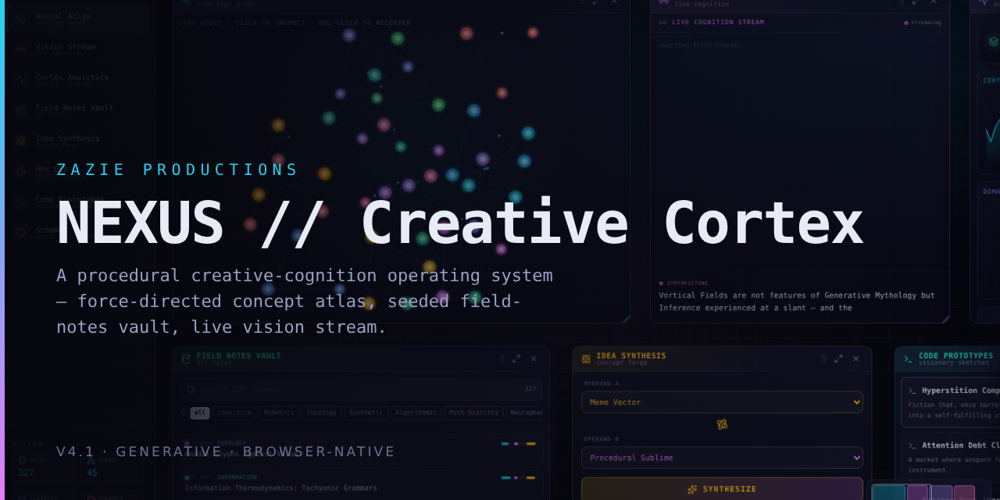

# NEXUS // Creative Cortex v4.1

A fictional creative-cognition operating system, rendered entirely in the browser: a force-directed concept atlas, a 327-note procedural field-notes vault, a live aphorism stream, and eight draggable instrument panels on a freeform stage — every byte of content generated deterministically from a handful of seeds.

**Created by Zazie Productions**

> Click the interface below to launch the live project.

[](https://zazieproductions.github.io/CREATIVE-CORTEX-V4.1/)

[](https://zazieproductions.github.io/CREATIVE-CORTEX-V4.1/)

     

> **A note on "audio / performance".** NEXUS is silent by design — there is no audio graph. It is, however, continuously animating: the atlas runs a requestAnimationFrame force simulation and the whole OS repaints at display rate. On low-powered hardware expect the fan; that is the instrument idling.

---

## Overview

NEXUS presents itself as the desktop of a polymathic mind. It is not a productivity tool; it is a portrait of one — an instrument panel for a cognition that does not exist, populated by a seeded generator that writes its own field notes, coins its own concepts, and drafts its own schemes. Nothing is fetched, nothing is stored, nothing is random at runtime: reload the page and you get the identical artefact.

The eight modules are:

| Module | What it is |
| --- | --- |
| **Neural Atlas** | A 45-node, 76-edge force-directed knowledge graph across 15 invented domains. Drag nodes, click to inspect, double-click to recenter. |
| **Vision Stream** | A live cognition feed that "types" aphorisms from a fragment grammar and archives them. |
| **Cortex Analytics** | Seeded pseudo-metrics: activity series, domain radar, idea velocity, gauges. |
| **Field Notes Vault** | 327 generated notes with titles, bodies, tags, scores, and inter-note links; searchable and filterable. |
| **Idea Synthesis** | A concept forge: pick two concepts, synthesize an emergent hybrid, commit it to the vault. |
| **Hex Lab** | A seeded palette foundry with lockable swatches and live preview. |
| **Code Prototypes** | Six speculative code sketches (TS / Python / GLSL / Rust) with a tiny regex tokenizer. |
| **Schemes** | Six authored social-engineering schemes — the work's clearest statement of intent. |

## Why this exists

NEXUS is an exercise in **generative world-building**: can a coherent intellectual persona be conjured from a deterministic pipeline rather than a hand-authored database? The answer the project explores is that *structure* (domains, bridges, scores, links) plus a *voice* (the fragment banks) is enough to make a system feel inhabited. It is also a portfolio study in browser-native rendering — SVG force simulation, pointer-capture dragging, pan/zoom cameras, and a glass design system — with zero runtime dependencies beyond React.

## Live demo

The canonical deployment target is GitHub Pages at
[`https://zazieproductions.github.io/CREATIVE-CORTEX-V4.1/`](https://zazieproductions.github.io/CREATIVE-CORTEX-V4.1/), wired by [`.github/workflows/deploy-pages.yml`](.github/workflows/deploy-pages.yml). The site activates automatically on push to `main` once Pages is enabled for the repository (see [docs/development/deployment.md](docs/development/deployment.md)).

Until then, run it locally — it is a static client app with no backend:

```bash
npm ci
npm run dev        # http://localhost:5173/
```

## Features

- **Deterministic generation.** A single mulberry32 PRNG per subsystem; identical output on every load, in CI, and in screenshots.
- **Freeform workspace.** Eight panels you can drag, resize, hide, expand, and raise; a pan/zoom stage with clamped camera, zoom controls, and a clickable minimap.
- **Force-directed atlas.** O(n²) repulsion + spring edges + centering + jitter, with O(1) node lookup and pointer-capture dragging.
- **Global command palette.** `⌘K` / `Ctrl+K` searches notes, concepts, and schemes with keyboard navigation.
- **Cross-linked corpus.** Notes reference concepts and each other; the atlas inspector surfaces linked notes.
- **Design-token system.** Every colour, font, and animation resolves to a Tailwind v4 `@theme` token.

## Interaction / controls

| Action | How |
| --- | --- |
| Open command palette | `⌘K` / `Ctrl+K` |
| Pan the stage | drag empty backdrop |
| Zoom | `Ctrl` + scroll, or the `+` / `−` / fit controls |
| Navigate quickly | click the minimap (bottom right) |
| Drag / resize a panel | drag its header / its bottom-right grip |
| Expand a panel | the ⤢ button in a panel header |
| Hide a panel | the ✕ button, or the eye toggle in the sidebar |
| Inspect a concept | click a node; drag to move it; double-click the atlas to recenter |
| Forge an idea | Idea Synthesis → choose operands → **synthesize** → **commit to vault** |
| Reset layout | sidebar → **reset layout** |

## Technical architecture

See [ARCHITECTURE.md](ARCHITECTURE.md) for the full system design and diagrams. In one paragraph: React holds *UI state* (panel layout, camera, selection, modals) while the *content* is produced once at boot by pure seeded generators in `src/lib`. The atlas keeps its mutable simulation in refs and re-renders on a rAF tick; everything else renders from memoized derived data. Styling is Tailwind v4 with a token layer; the one bitmap (`atlas-bg.png`) is itself procedurally generated by a Node script so it matches the CSS backdrop.

## Project structure

```
├── .github/              # CI, Pages deploy, issue/PR templates
├── archive/              # preserved generation-harness provenance (non-shipping)
├── docs/                 # architecture / design / technical / development / images
├── public/               # favicon.svg, atlas-bg.png, og-image.png
├── scripts/              # generate-atlas-bg.mjs, capture-screenshots.mjs
├── src/
│   ├── components/
│   │   ├── shell/        # workspace chrome + primitives (OsBar, Panel, Modal, …)
│   │   └── panels/       # the eight content modules
│   ├── lib/              # pure generators + design config (seeded, testable)
│   ├── styles/           # tokens.css, base.css, index.css
│   └── types.ts
└── tests/                # Vitest suite over the lib layer + assets
```

## Installation & local development

Requires Node ≥ 20.

```bash
npm ci              # clean install
npm run dev         # dev server (HMR) at http://localhost:5173/
npm run typecheck   # tsc project build, no emit
npm run lint        # eslint (strict, with two documented relaxations)
npm test            # vitest run (30 tests)
npm run build       # tsc -b && vite build (Pages base path)
npm run preview     # serve the production build
```

## Production build & deployment

`npm run build` emits with a base path of `/CREATIVE-CORTEX-V4.1/` so the bundle resolves under the GitHub Pages project-site sub-path. The deploy workflow builds and publishes to Pages on push to `main`. For a domain-root build set `VITE_BASE=/`:

```bash
VITE_BASE=/ npm run build && npm run preview
```

## Screenshots

Real captures, driven through a headless Chromium by [`scripts/capture-screenshots.mjs`](scripts/capture-screenshots.mjs) (never mocked):

| | |
| --- | --- |
| [](docs/images/project-preview.png) | [](docs/images/project-active.png) |
| default workspace | idea forge fired |
| [](docs/images/project-detail.png) | [](docs/images/github-social-preview.png) |
| command palette | social card |

Regenerate after UI changes:

```bash
npm run build && npm run capture:screenshots
```

## Design system

Documented in [docs/design/visual-language.md](docs/design/visual-language.md). The interface is a dark "instrument" language: near-black void, glass panels, hairline indigo borders, JetBrains Mono for all readouts, and five signal accents (cyan / magenta / violet / amber / acid) that double as semantic state colours.

## Concept / artistic context

See [docs/creative/concept.md](docs/creative/concept.md). NEXUS is built from the vocabulary of recovered software and scientific instrumentation — a damaged, half-credible machine for thinking. Its "glitches" (the typos in its own ontology, the self-incriminating schemes) are intentional.

## Performance considerations

- The atlas is O(n²) per frame (n = 45) — trivial — with node lookup reduced to O(1); the cost is React re-rendering one SVG at display rate.
- `backdrop-filter` glass is the main GPU cost; it is bounded to panel surfaces.
- Content generation runs once at boot (~327 notes) and is memoized.
- See [docs/technical/performance.md](docs/technical/performance.md).

## Browser support

Modern evergreen browsers with `backdrop-filter`, pointer events, and ES2022: recent Chrome, Edge, Firefox, Safari. No IE.

## Accessibility

NEXUS is a dense, motion-heavy instrument and is honest about its limits: it is keyboard-navigable for the palette (`⌘K`, arrows, `Enter`, `Esc`) but the pointer-driven stage is not currently screen-reader friendly. Reducing decorative motion and a prefers-reduced-motion pass are tracked in [ROADMAP.md](ROADMAP.md).

## Testing

`npm test` runs a Vitest suite over the deterministic layer: RNG properties, corpus invariants (counts, unique ids, resolvable links, score ranges), atlas graph integrity, palette validity, analytics clamps, layout bounds, tokenizer round-trips, and public-asset presence. See [tests/](tests/).

## Roadmap & contributing

- [ROADMAP.md](ROADMAP.md) — near-term, experimental, and research directions.
- [CONTRIBUTING.md](CONTRIBUTING.md) — the lightweight workflow.
- [SECURITY.md](SECURITY.md) — how to report issues.
- [CHANGELOG.md](CHANGELOG.md) — what changed and why.

## License

**Unresolved, intentionally.** No license file ships with this archive; all rights remain with Zazie Productions until the author chooses a license. See the License section of [CONTRIBUTING.md](CONTRIBUTING.md). Do not treat the presence of source as a grant of rights.

## Credits

Concept, code, and design — **Zazie Productions**. Type: Space Grotesk & JetBrains Mono (Google Fonts). Icons: lucide-react. Built with React, Vite, and Tailwind CSS.
