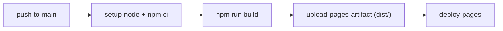

# Deployment

How NEXUS//OS reaches the public internet, and how to verify it got there
intact.

---

## Target: GitHub Pages

The project is a static SPA, so GitHub Pages is the natural home. The live build
is at:

<https://zazieproductions.github.io/CREATIVE-CORTEX-V4.1/>

### What makes it deployable from a sub-path

`vite.config.ts` sets `base: './'`, which makes every asset URL page-relative.
Three consequences:

1. `index.html` references `./assets/…` (hashed JS/CSS) — correct at any depth.
2. `Workspace` loads the atlas backdrop as
   `import.meta.env.BASE_URL + 'atlas-bg.svg'` — correct at any depth.
3. The favicon is referenced as a relative `favicon.svg` — correct at any depth.

Because there is **no client-side router**, there are no refresh/deep-link
problems: every URL serves the same single view.

## Automatic pipeline

`.github/workflows/deploy-pages.yml`:



Triggered on pushes to `main` and manually via `workflow_dispatch`. The
workflow uses the official `actions/configure-pages`, `upload-pages-artifact`,
and `deploy-pages` actions.

## One-time owner setup

GitHub Pages must be enabled once, by a repository admin — it cannot be turned
on from a workflow or from a bot token (the GitHub API returns 403 for
non-admin tokens):

1. **Repository → Settings → Pages → Source → "GitHub Actions".**
2. In the same screen, confirm the environment is `github-pages` (the workflow
   declares it).
3. Merge the branch carrying the workflow into `main` (or trigger it manually
   with **Actions → Deploy to GitHub Pages → Run workflow**).

After the first successful run, the site is live at
`https://zazieproductions.github.io/CREATIVE-CORTEX-V4.1/` and every subsequent
push to `main` redeploys automatically.

## Manual deployment

```bash
npm run build
# push dist/ to any static host
```

The build output is fully portable — `dist/` can be dropped onto GitHub Pages,
Netlify, Cloudflare Pages, Vercel, or any file server with no changes, because
of `base: './'`.

## Verification checklist

After a deploy, confirm:

1. **Assets resolve** — open the network panel; no 404s for `./assets/*.js`,
   `favicon.svg`, `atlas-bg.svg`, or font files.
2. **Fonts load** — the interface uses Space Grotesk/JetBrains Mono, not system
   fonts, and there are no requests to `fonts.googleapis.com`.
3. **Instruments animate** — graph nodes drift, pulses travel, the vision
   stream types.
4. **Palette opens** — `Ctrl/⌘+K` brings up search and it returns results.
5. **A modal opens** — clicking a Code Prototype or a note shows the modal.
6. **Refresh works** — reloading at the root (or any path, since there is no
   router) renders the app.
7. **Social preview** — `https://…/og-cover.png` returns the 1280×640 card
   (mirrored from `docs/images/github-social-preview.png` by the capture script).

## Social preview image

The repo-level social card (`docs/images/github-social-preview.png`, 1280×640)
is uploaded manually, because GitHub does not read it from the repository tree:

**Repository Settings → General → Social preview → Upload an image.**

The same image is committed to `public/og-cover.png` so the deployed site's
`og:image` meta tag resolves without the manual step.

## Repo metadata

The repository description, topics, and website are set via `gh`:

```bash
gh repo edit zazieproductions/CREATIVE-CORTEX-V4.1 \
  --description "Speculative 'creative-genius OS': force-directed neural atlas, procedural field-note vault, generative concept synthesis." \
  --homepage "https://zazieproductions.github.io/CREATIVE-CORTEX-V4.1/" \
  --add-topic creative-coding --add-topic generative-art # …and the rest
```
